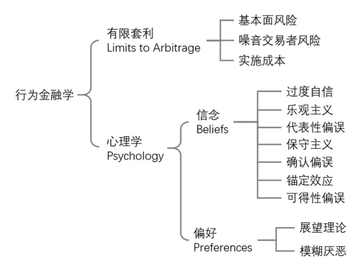

[TOC]

# 简述
这篇文章是2017年诺贝尔经济学奖得主Richard Thaler在2002年发表的论文“A Survey of Behavioral Finance”。论文系统性地阐述了行为金融学的理论框架及其实践应用,探讨了行为金融学的发展历程、关键概念、实证研究和对传统金融理论的挑战。

## 引言
如今，行为金融学的发展也已经走过了半个世纪。由于投资者和交易者都是非理性的，行为金融学能够解释很多市场中的现象，因此也受到越来越多的关注。关于这门学科的发展历程，来自剑桥大学的 Martin Sewell 曾经写了一篇很好的综述（Sewell 2007）。该文按时间顺序梳理了行为金融学领域最重要的发现。

为了更好的将行为金融学的发现应用到投资中 —— 自己可以用来规避各种偏差、也可以用它作为武器来利用别人所犯的错误 —— 需要对行为金融学的整体框架有一个全面的掌握。实现这个目标需要我们阅读大量的文献资料，并把知识点有机的组织在一起，听上去像个 mission impossible。

Richard Thaler 和他的同事 Nicholas Barberis 于 2003 年写了一篇题为 A Survey of Behavioral Finance 的文章（Barberis and Thaler 2003），总结了行为金融学的知识框架（下图）。对于想要一窥行为金融学全貌的小伙伴来说，这是一篇 must read。按照 Barberis and Thaler (2003) 的解读，行为金融学的两大支柱是有限套利（Limits to Arbitrage）和心理学（Psychology），其中心理学中又分为信念（Beliefs）和偏好（Preferences）两部分。每一部分下面又有各自的理论和内容，它们构成了行为金融学的全貌。


本文就以介绍 Barberis and Thaler (2003) 为契机展开一些思考。下文第二、三小结分别介绍有限套利和心理学的内容；第四节说明行为金融学在解释市场整体表现（aggregate stock market）和股票截面收益（cross-section of average returns）时的作用；第五节介绍一个比较新的概念Behavioral Efficient Markets，这是 Barberis and Thaler (2003) 没有的内容，但能够和它完美的结合在一起；第六节总结全文。

### 有限套利
根据传统金融理论，市场应该满足有效市场假说（Efficient Markets Hypothesis，EMH），而 EMH 的两个核心假设是“价格反应全部信息并迅速调整到位”以及“所有投资者都是理性的”。显然，这两个假设均被现实无情的打脸。行为金融学为解释由于人的非理性行为而造成市场中各种价格相对价值的偏离提供了新的思路。

在实际市场中，信息在不同投资者之间的传递速度是不同的；由于投资的时间尺度不同，不同投资者关注的信息也有所差异。这使得人们无法对同样的信息做出一致的反应。此外，人们的决策行为受到非理性支配的，它源自存在于人类大脑中的根深蒂固的认知偏差。

观察到市场中的非理性行为，Shiller (1984) 提出了噪音交易者模型，认为市场由理性投资者和噪音交易者（noise traders）构成。在一次影响深远的美国金融学会主席演讲中，Fischer Black 对噪音交易者做出了如下进行了定义：
```
噪音交易是针对信息噪音的交易，这时投资者以为其拥有了新的信息，但事实上这一信息只是假象。从客观的角度来看，噪音交易者不进行交易是更好的选择。但即使如此，他们仍会针对信息噪音进行交易，这可能因为他们误将噪音当成了真正有用的信息，也可能因为他们只是喜欢交易。
```
由于噪音交易者的存在，价格往往偏离资产的内在价值，即出现定价错误（mispricing）。在一个没有摩擦的市场中，每当价格偏离价值时，理性投资者（也被称为 arbitrageurs，即套利者）应该迅速利用这个机会进行交易，赚取无风险收益（riskless profits）并同时修正价格。然而，行为金融学指出，上述假设是不成立的，而这背后的原因正是有限套利（limits to arbitrage）。

当 mispricing 出现时，理性投资者想要利用它赚取收益时要面对以下三个风险：
- 基本面风险（fundamental risk）
- 噪音交易者风险（noise trader risk）
- 实施成本（implementation costs）
这些风险使得理性投资者无法做到充分套利。

#### 基本面风险
假设某股票的价格因噪音投资者的抛售而下跌，大幅低于其内在价值。如果套利者想要买入它获得无风险收益的话，必须要防范该股票的基本面风险。为此，套利者需要同时做空一个和该股票基本面相同的股票。然而，能够完美对冲基本面风险的标的是不存在的，这就使得套利者在买入该股票时或多或少的暴露在它的基本面风险之中。一旦发生基本面负面信息，将会造成该股票的继续下跌，给套利者带来亏损。

#### 噪音交易者风险
Keynes 曾说过：

```
Markets can remain irrational longer than you can remain solvent.
```
这大概是对噪音交易者风险的完美诠释。噪音交易者的非理性行为会造成价格在短期内持续偏离价值，而非像套利者期待的那样发生回归。这个风险会给套利者带来职业风险（career risk）：市场上的资金委托专业管理人，而绝大多数资金都是 short-sighted performance chasers。这些资金并不知道套利者背后的交易逻辑（可能是一个完美对冲了基本面风险的套利策略），而仅是根据净值曲线的短期走势评估管理人的水平。

当噪音交易者的非理性加大了 mispricing 时，由于套利策略的持续亏损，管理人将面临巨大的资金赎回压力，这将迫使他们卖掉手中的头寸，无法等待价格的回归。短期业绩惨淡造成资金被赎回正是管理人面对的职业风险。这是噪音交易者风险的直接结果。

#### 实施成本
实施成本具体包括两部分。
- 第一部分是为了建立套利头寸需要付出的成本
手续费、交易价差、价格冲击以及做空需要付出的费用等。在有些市场，做空难以实现，这便进一步加大了实施套利的风险。
- 第二部分是为了寻找 mispricing 所付出的成本
由于内在价值难以确定，因此判断价格是否等于内在价值本身就是非常困难的。

有些研究曾指出当噪音交易者造成了足够大的 mispricing 后，资产后续的收益率将有一定的预测性，因此可以通过分析 return pattern 来鉴别套利机会。不过 Shiller (1984) 却无情的指出，以上想法是“one of the most remarkable errors in the history of economic thought”。他的研究表明，即便当价格持续偏离价值时，收益率也并没有表现出显著的可预测性。

如果我们顺着 EMH 的思路推断，那么可以从“价格等于内在价值”（prices are right）推导出“市场中没有免费的午餐”（no free lunch）；然而，有限套利告诉我们，即便在非有效的市场中，“没有免费的午餐”也是可以成立的，但我们却无法从“没有免费的午餐”反推出“价格等于内在价值”，这是因为理性投资者无法通过套利来消除 mispricing、赚取无风险收益。


### 心理学
如果说有限套利使得价格无法回归价值是“果”，那么交易者的各种非理性行为造成的价格偏离价值正是“因”。行为金融学中的第二个支柱正是借助心理学的研究来分析人们的各种系统性认知偏差（cognitive biases），它们影响了人们信念（beliefs）以及做风险决策时（比如是否买、卖某只股票）的偏好（preferences）。

#### 信念

大量的研究表明，人们在金融市场中表现出如下错误的信念（或者行为）：

##### 过度自信 - overconfidence
过度自信有2层影响：
- 影响人对数量的判断，人在对数量进行主观预测的时候，往往会过度自信，比如预测大盘点位
- 影响人对概率的判断：人主观判断那些一定会出现的事件，实际上出现的概率只有80%；而他们认为不可能出现的事件，出现的概率有20%。
##### 乐观主义 - optimism
大部分人对自己感觉良好，比如通过调查发现，90%的受访者认为他们的驾驶技术、与人相处能力和幽默感在平均水平之上，其实不然。另外很多人在处理需要进行系统性安排的事情时，往往会**过于乐观**地估计自己完成这些事情的速度。好比说你计划这个周末看看某个公司的季报和数据，计划在下周二财报出来时判断如何调仓。结果周末纸醉金迷、夜夜笙歌，到了周二数据只分析了不到一半，财报出来后，迫于“必须赶紧行动”的压力，就一拍脑门的作出了决策。
##### 代表性偏误 - representativeness
人类在对事件做出判断的时候，过度关注于这个事件的某个特征，而忽略了这个事件发生的大环境概率和样本大小。比如有的投资人过度关注于一只股票的每股盈利，在这只股票EPS大幅好预期的时候买入，其实这时投资就有可犯了错。因为投资人往往会过忽略“这个大幅好于预期”发生的总体概率，而过度的关注“大幅好于预期”后股票“单纯上涨的概率”，殊不知如果大幅好于预期是小概率事件的话，此时买入的点位有可能已经过高。


Tversky and Kahneman (1974) 在 Science 上撰文称，当人们试图判断数据 A 是否来自模型 B，或者样本 A是否属于类别 B 的时候，往往依靠代表性启发法（representativeness heuristic），即考察 A 和 B 的相似程度。这种做法可能造成一些严重的偏误。

第一个偏误是忽视结果的先验概率（insensitivity to prior probability of outcomes）。举个例子，通过下列对某男子的描述来判断他的职业：“Steve 非常害羞、虽然乐于助人但却不喜欢与人打交道；他是一个温顺的人，执着于事物的有序性并对细节有极致追求。”请问他的职业是农民、销售、还是图书馆管理员？

我们可以使用贝叶斯定理来判断 Steve 的职业：

```math
P(occupation|desc) = \frac{P(desc|occupation) * P(occupation)} {P(desc)}
```

在这个过程中，忽略先验概率偏误指的是人们过度关注上述描述和职业之间的相似性，即上式中的 likelihood —— prob(desc|occupation)，而忽视了某个职业出现的先验概率。在这个例子中，关于 Steve 的描述非常符合人们印象中图书管理员的特点，因此人们会错误放大 prob(desc|occupation) 而完全不考虑现实世界中图书管理员的比例，即先验概率 prob(occupation)。这将导致人们错误的认为 Steve 的职业是图书管理员。在现实世界中，农民比图书管理员要多得多，因此先验概率大得多，所以 Steve 其实更有可能是一个农民。

Representativeness 的第二个偏误是对样本大小不敏感（insensitivity to sample size），我在《投资中的 N 种认知偏差，总有一款打败你》介绍过这一点。我们经常看到这样标题的文章：《大数据告诉你 XX 月大盘怎么走》、《大数据告诉你 XX 节后是涨是跌》。点开一看，所谓的大数据就是一共十来个样本点。当样本点非常少的时候，使用有限的样本点根本无法可靠的计算出变量的变化范围，这也是我们常说的 law of small numbers 误区。

在投资中，由于 data generating process 是未知的，因此只有当交易次数足够多的时候，我们才有能客观的评价一个策略的优劣；仅在有限次交易后就急于评价交易系统则是一种错误的做法。而如果 data generating process 是已知的，那么 law of small numbers 则会造成赌徒谬误（gambler’s fallacy）。在投资中，赌徒谬误意味着当交易者经历了连续的几次亏损后就会错误的认为下一次交易赢钱的概率会更高。如果每次交易的结果是独立的，那么下一次交易的胜率和之前的连续亏损（或者连续盈利）没有关系。

##### 保守主义 - conservatism
受到保守主义的影响，当人类在做决策时，如果手头上有的信息不是这个事件的直接特征，往往会忽略这个事件的最直接特征，而过度的关注于自己手头上有的信息。而且投资人对新的消息的处理速度会比较慢，比如有的投资人预测苹果要出新的iPhone X，并且预测这个iPhone X能给苹果带来非常好的市场效应。但是当苹果宣布iPhone X预产可能会被推迟时，投资人往往会对这个新的坏信息表现出较慢的反映速度，将决策的权重，过多的给予之前已知的信息。
##### 确认偏误 - confirmation bias
倔强可以说是保守主义的衍生品。人往往固持己见，对自己已有的信仰过长或者过度的坚持。比如有的投资人就认为价值投资，就是要去一个一个的做个股分析，深挖财报。这个道理没错，但是如果你跟他说使用量化的手段，可以更好的实现价值投资，他们可能带有成见的说你在扯淡。人类往往难以接受现实，明明知道一个事情可能是对的，但是由于这个事情与自己的认知不同，就难以保持一个开明的心态。塞勒教授举栗子说，如果你刚开始接触并且相信了EMH，当有与EMH相反的充足证据出现时，你也会很难改变你对EMH的信念（这是对尤金法玛和肯弗兰奇捅刀子么）。
##### 锚定效应 - anchoring
在做投资的时候，投资人往往把股票的心理价位，锚定在股票之前的表现中：有浮亏的股票，投资人会过度的关注自己的成本，老想着等未来股票涨回自己的成本后，再抛售。其实你抛售不抛售，是应该根据未来的预期，而不是根据过去成本的【锚】；有浮盈的股票，投资人会过度的关注浮盈，将对股票的预期，锚定在现有的盈利上：过度关注下跌风险，而忽略了股票继续上升的赢面。说白了就是人在做决策时，不能理性的选择参照物。
##### 易得性偏误 - availability bias
在进行决策时，过度使用自己熟悉的或者能够轻易凭空臆想出来的信息。【脑白金】就是非常直接的栗子，你每天被“过年爸妈不收礼，收礼就收脑白金”狂轰乱炸，本来送礼就是一件费脑的事情，你的直接反应很可能就是买脑白金得了。又或者是天天看新闻和股票，脑子里装的都是龙头股、红利股，买的时候随便看看K线，直接就敲这些股票的代码，非常**易得**。

以及信念都是交易者在投资中面对的敌人。从 main street 的个人投资者到 wall street 的专业机构，都在日复一日年复一年、乐此不疲的重复着这些错误，因为这些偏差源于人性和思维模式。

#### 偏好

##### 展望理论

资产的收益充满着不确定性，而人们在风险下如何做决策的问题就是偏好问题。在这方面，最著名的且符合现实的模型当属展望理论（Prospect Theory，也译作前景理论），它由 Daniel Kahneman 和 Amos Tversky 提出（Kahneman and Tversky 1979, Tversky and Kahneman 1992）。这二位在行为金融学的地位也无需多言。


展望理论研究人如何在风险下做决策。决策问题可以描述为：一个人可能面对着 n 种不同的选项（比如投资股票还是债券？），每个选项可以有 m 种结果，而每个结果有一定的概率。当人们面对不同的选项时：

1. 首先评估每个选项中所有可能结果，并据此得到每个选项对于他自己的“主观价值”；
2. 然后再比较所有选项的“主观价值”高低；
3. 最后选择价值最高的那个选项。

为了做出最优选择，决策者必须评估每个选项的价值，然后比较不同的选项。每个选项的价值由价值函数和权重函数决定。

价值函数评价的是一个决策的结果 x 给人造成的主观价值 v(x) 的大小。v(x) 的形状如下图所示，有三个核心要素：

1. 结果 x —— 即得与失（gains and losses）——是相对一个给定的参考点而言的，而主观价值 v(x) 是 x 的非线性函数。
2. 无论对于收益或者亏损，价值函数的敏感性递减。换句话说，当结果为正收益时，价值函数为凹函数；当结果为负收益时，价值函数为凸函数。
3. 人们厌恶风险，且亏损部分的负增长快于收益部分的正增长：v(x) < -v(-x)。比如，亏损 1000 块的痛苦高于获利 1000 块的快乐。


权重函数决定某个选项中每个结果的权重。权重 w(p) 是结果的产生概率 p 的函数，但它不是概率。它衡量的是每个结果对其所在的选项的影响，而非仅仅是该结果发生的可能性。展望理论指出，w(p) 和 p 的关系如下图所示。


权重函数是非线性的，而且当 0 < p < 1 时它是凸函数。这说明结果概率的增量带给人们的边缘权重增量随着概率本身的增大而增大。这可以理解为人们对确定性的一种追逐。

比如在俄罗斯轮盘赌（Russian roulette），我们有机会花钱来从左轮手枪中减少一发子弹。在这种情况下，根据枪膛中剩余子弹数目的不同，人们愿意花不同的价钱。显然把子弹从 2 颗减少到 1 颗比把子弹从 4 颗减少到 3 颗会让人愿意出更多的价钱。在前者中，我们把不被击中的概率从 4/6 提高到了 5/6；而在后者中，我们把上述概率从 2/6 提高到了 3/6。虽然都是提高了 1/6，但显然前者的吸引力大于后者。这显示了w(p) 的凸性。如果仅剩余 1 颗子弹而我们可以通过花钱来把它去掉的话（把不被击中的概率提升到1），那么无论出多少价都是值得的。

此外，上图中当 p 在零附近时，w(p) 显著的大于 p，表明当一个结果出现的概率非常小时，人们往往容易错误地放大其发生的可能性。来看两个例子。

例子一：从下面两个选项中选择。

- （a）0.1%（百分之 0.1，非常小）的概率得到 5000 元
- （b）100% 的概率得到 5 元
在所有参与者中，72% 的人选择了（a）而仅有 28% 的人选择了（b）。

例子二：从下面两个选项中选择。

- （a）0.1%（百分之 0.1，非常小）的概率损失 5000 元
- （b）100% 的概率损失 5 元
在所有参与者中，17% 的人选择了（a）而 83% 的人选择了（b）。

例子一描述了一个生活中非常熟悉的场景。我们平时买彩票就类似这个情况。假设一张彩票是 5 元钱，而买了彩票后你有千分之一的机会得到 5000。这看起来是如此诱人，以至于绝大多数实验者选择了（a）。这是因为人们放大了这个千分之一的可能性在评估两个选项时对选项（a）的作用。

同样的，在例子二中，人们也放大了损失 5000 这件事对应的千分之一的可能性。这就像人们买保险一样，和损失的 5 元保险费相比，人们更愿意避免千分之一才会发生的损失 5000 元的事故。因此，二者之间更多的人选择了（b）。

价值函数和权重函数构成了展望理论的基石；而展望理论能够成功的解释人们面对风险时的决策偏好。


#### 模糊厌恶

偏好下的第二个方面是模糊厌恶（Ambiguity Aversion）。

在决策论中有一个著名的 Ellsberg 悖论（Ellsberg 1961）。假设有两个罐子，每个罐子里放有红色和蓝色一共 100 个小球。这两个罐子的区别是，罐子 1 中红色和蓝色球的数目均是未知的；而罐子 2 中红色和蓝色小球各 50 个。

实验者首先被要求从下面两个选项中选择：

- A1：从罐子 1 中抽取一个小球，如果是红色小球则获得 100 块，如果为蓝色则没有奖励；
- A2：从罐子 2 中抽取一个小球，如果是红色小球则获得 100 块，如果为蓝色则没有奖励。

这两个选项的唯一区别是抽小球的罐子。

在第二个实验中，实验者被要求从下列两个选项中挑选：

- B1：从罐子 1 中抽取一个小球，如果是蓝色小球则获得 100 块，如果为红色则没有奖励；
- B2：从罐子 2 中抽取一个小球，如果是蓝色小球则获得 100 块，如果为红色则没有奖励。

实验二和实验一的区别在于获得奖励的小球颜色从红色变成蓝色。

面对这两个实验，神奇的结果发生了：在实验一中，更多的实验者选择了 A2；而在实验二中，更多的实验者选择了 B2。实验一的结果说明，人们主观认为罐子 1 中的红色小球数量比罐子 2 中的红色小球（已知为 50 个）更少；而实验二的结果则截然相反，人们主观的认为罐子 1 中的蓝色小球数量比罐子 2 中的蓝色小球（也是 50 个）更少。

上述实验结果说明，在充满着不确定性的博弈中，人们讨厌结果分布未知的情况。这正是模糊厌恶。在面对风险决策时，如果结果的分布是已知的，那么该决策的不确定性对于我们来说是已知的，我们可以通过结果的分布精确的量化出该不确定性；反之，如果结果的分布是未知的，那么这个不确定性对我们而言也是未知的，因此无法被精准量化出来。

由于模糊厌恶，人们自然的站在了模糊性的对立面 —— preference for the familiar，即选择自己熟悉的。在投资中，这体现在人们会根据自己的经验、学识和能力选择更熟悉的标的来投资。当然，这个出发点并没有问题，股神巴菲特也说“I never invest in anything that I don’t understand.”。不幸的是，这也并不容易。由于过度乐观以及确认性偏误这些认知偏差，人们往往在自认为熟悉的领域栽的更惨。蹭个热点，正如《三体》中说的那样：弱小和无知不是生存的障碍，傲慢才是。

以上就是偏好部分的两个内容 —— 展望理论和模糊厌恶。这些理论很好的解释了人们在面对风险时是如何做决策的，它们和前文提到的各种认知偏差一起构成了心理学这个行为金融学的第二大支柱。

### 在金融市场中的应用
在 Barberis and Thaler (2003) 这篇长达 77 页的论文中，前面 20 多页阐述了行为金融学的知识框架；而后面更多的部分则介绍了它在金融市场中的应用。在此我们挑选一些典型的例子做简要介绍。

首先来看市场整体行为。这其中最重要的例子大概是股权溢价之谜（Equity Premium Puzzle）。1926 年以来，美国股市每年扣除通胀后的平均回报约为 7%，而政府债券的回报率不足 1%。面对如此大的差异，债券投资者的比例却远超股票投资者。如果把股票和债券各自的收益率和标准差套入到效用函数中，上述现象的“合理”解释只能是投资者的风险厌恶水平非常高。因此这种解释并不合理，这便是股权溢价之谜。

从行为金融学的角度则可以间接的解释它，而其中的一个角度则是 Thaler 提出的短视损失厌恶（myopic loss aversion，Benartzi and Thaler 1995）。具体的，Thaler 使用展望理论和心理账户理论解释了这一现象。

投资者存在损失厌恶，且展望理论的价值函数指出损失给人造成的效用大概是同等大小收益带来效用的两倍。这增大了债券这种低风险资产的吸引力。在心理账户理论中，其第三部分是关于评估账户的频率，而不成熟的、非理性的投资者倾向于频繁查看自己的股票是赚了还是亏了。损失厌恶 + 频繁评估盈亏则造成了短视损失厌恶。

Thaler et al. (1997) 做了一个实验。不同的投资者被要求按照不同的频率（每年 8 次、每年 1 次，每 5 年 1 次）在股票和债券之间进行资产配置。对于调仓频率低的投资者（即每年 1 次和每 5 年 1 次的），他们将 67% 的资金配置在股票上，将 33% 的资金配置于债券；而对于调仓频率高的投资者（每年 8 次），他们仅仅将 41% 的资金配置在股票上，而将 59% 的资金配置于债券。这说明，调仓频率高的投资者容易受到股票高波动、高风险、以及近期亏损的影响，出现短视损失厌恶。频繁评估给股票投资者带来更多的痛苦，使他们高估低风险债券的吸引力，从而更多的投资者去投资债券，造成股权溢价之谜。

除了解释一些市场整体行为外，行为金融学在解释股票预期收益率的截面差异上似乎更大有可为。这些截面差异就是我们常说的异象，包括 value、momentum、long-term reversal 以及各种 event studies，比如 PEAD。

在这方面，最著名的论文之一是 Barberis, Shleifer, and Vishny (1998) 提出的投资者情绪模型（著名的 BSV 模型）。他们认为投资者在面对上市公司新的财报消息时会受到保守主义和代表性偏误的影响，这会导致一些常见的异象。

首先，当超出预期的盈利消息出现时，投资者因保守主义而愿意相信自己的先验判断，而对这个新息反应不足。他们会对这个利好持怀疑态度、不情愿更新他们对于该公司基本面的认知，因此新息无法有效的反映在股价上。随着时间的推移，当该公司又逐渐出现新的盈利利好时，其股价才会慢慢对其新的基本面反映到位，而这正好造就了 momentum 异象。Bernard and Thomas (1989) 提出了盈余动量现象（post-earnings-announcement drift，PEAD），也是投资者对利好消息反应不足的体现、符合上面这种解释。

其次，当好的盈利消息接二连三出现时，会引起投资者的过度反应并陷入代表性偏误的误区。这意味着他们过度看中最近发生的这些连续的利好消息、并把这种预期错误的外推到对公司未来股价的预测上；一旦未来的盈利没有达到预期，就会引起他们的恐慌，造成股价的下跌，这会造成 long-term reversal 异象以及 value 异象。

其他影响深远的文章包括 Daniel, Hirshleifer, and Subrahmannyam (1998)、(2001)。他们研究的重点在于投资者在处理私有信息时所容易产生的认知偏差。假设投资者对于某个上市公司做了大量深入研究。在这种情况下，他容易对自己的分析结果表现出过度自信。如果分析的结果认为该公司的基本面向好，他们就会大举买入该公司的股票；此外，在这个过程中，确认偏误会让他们在短期内仅仅关注与和自己分析结果相一致的公共信息，而忽略掉意见相左的信息，这就会造成 momentum 和 PEAD 这些现象。然而，当股价被推高后，如果接连出现基本面变差的信息，这时价格就会发生下跌修正，从而造成 long-term reversal 以及 value 异象。

如今，行为金融学在解释股票收益率截面差异时的作用被越来越多人接受。Daniel, Hirshleifer, and Sun (2018) 使用长、短两个时间尺度的行为因子，加上市场因子提出了一个复合三因子模型（见《一个加入行为因子的复合模型》）。该模型为实证资产定价研究提供了新的思路，且它对于已有异象的解释力度不亚于学术界一些主流的纯风险因子模型，是一个值得肯定的尝试。

### Behavioral Efficient Markets
2018 年，第 20 届 Bernstein Fabozzi / Jacobs Levy Awards 的 Best Article 奖授予了 Statman (2018) 这篇题为 Behavioral Efficient Markets 的文章。

这篇文章指出，有效市场假说其实包含了两侧含义，只有把它们剥离开来才能充分、合理的探讨市场的有效性。这两层含义分别为 price-equals-value market hypothesis 和 hard-to-beat market hypothesis。这篇文章的观点颇有见地，值得一读。

显然，这两层含义完美的对应着行为金融学的两大支柱：由于心理学造成的各种错误和有限套利，市场中的价格可能长期偏离价值而无法被修正，因此 price-equals-value market hypothesis 通常是不成立的，正如我们看到的那样。另一方面，对于仅仅掌握公开信息（widely available information）的普通投资者而言，市场是难以战胜的；唯有那些掌握 exclusively or narrowly available information 优势的投资者才有可能战胜市场。然而，认知和情感偏差造就了一波又一波、前赴后继的噪音交易者，并给他们造成了能够战胜市场的幻觉。

行为金融学认为市场并非 price-equals-value 市场，同时也指出对于绝大多数仅掌握 public information 的投资者，市场是 hard-to-beat market。Price-equals-value 意味着 prices are right；而 Hard-to-beat market 意味着 no free lunch。行为金融学否认前者但认可后者，这和 Barberis and Thaler (2003) 提出的 no free lunch 无法倒推出 prices are right 不谋而合。正因如此，Statman (2018) 将这两层含义下的市场命名为 Behavioral Efficient Markets。

# 思考
本文介绍了 Barberis and Thaler (2003) 提出的行为金融学知识框架。它对于我们学习该领域非常有帮助。此外，在很多 empirical asset pricing 的文章中，学者们都会从风险和行为的角度来解释提出的异象。从这个角度来说，掌握心理学和有限套利这两大支柱对于理解很多学术文献也十分有益。

2013 年，诺贝尔经济学奖同时颁发给了对市场有效性持完全对立立场的 Eugene Fama 和 Robert Shiller（另外一位是提出 GMM 的 Lars Peter Hansen）。Fama 和 Shiller 的同时获奖颇具“讽刺意味”。在颁发诺贝尔奖时，瑞典皇家科学院指出，这三位学者的发现表明“市场价格的波动受到理性和人性行为共同影响”。这是人们在探究市场真相道路上坚实的一步，也是行为金融学发展历程中的重要里程碑。