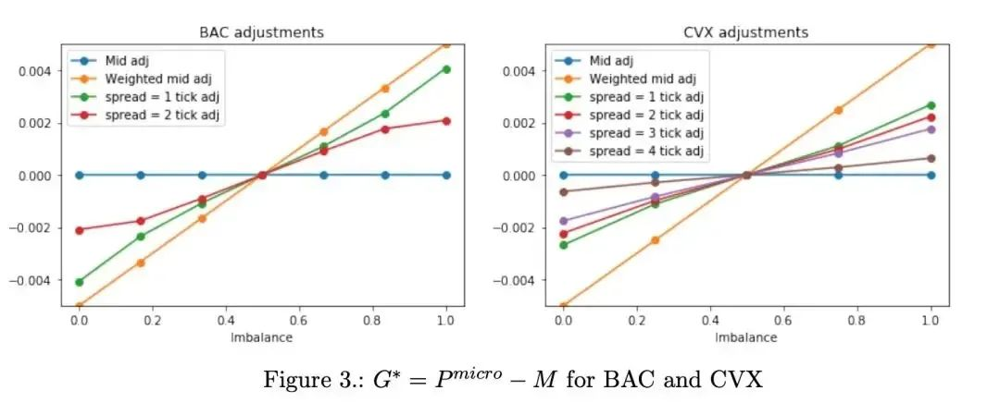

# 简述
在他2018年发表的这篇论文里，作者通过严谨的数学推导证明了Micro Price在高频价格的预测上优于mid和wmid。论文很短，只有14页，是行文简洁逻辑清晰的风格。

## 定义
下面是详细的micro price推导过程。作者先定义了第i个mid price的表达式，Ft是在t时刻订单簿中所包含的信息，τ1，..., τn表示中间价格M变化的时间：
```math
P_t^i = E[M_{\tau_{i}} | \digamma_{t}]
```

接下来定义了Micro Price，它等于当时间i趋近于无穷大时的mid price：

```math
P_t^{micro} = \lim_{i \to \infty} P_t^i
```
为什么要把时间设定为无穷大，作者解释了这样做的2个原因：一是方便对不同交易频率的资产做比较，把时间的因素剥离出去。二是比较远期的价格，过滤掉高频微观中的噪声。

在下一步的推导展开之前，作者做了2个假设。

## 假设
### 假设1
订单簿数据由三维的马尔可夫过程产生，三个静态变量分别是Mid中间价，订单不平衡程度和报价价差，这些都是由一档数据（买1卖1数据）构建的。表达式为
```math
Ft = σ(Mt, It, St)
```

- Mt中间价


- It订单不平衡
```math
I_t = \frac{Q_t^b}{Q_t^b + Q_t^a}
```

- St报价价差：
```math
S_t = \frac{1}{2}(P_t^a - P_t^b)
```

### 假设2
预期的中间价格增量与中间价格本身无关，也就是每一tick变动时，价格的动态都是相同的：
```math
E[M_{\tau_i}-M_{\tau_{i-1}}| M_t=M, I_t=I, S_t=S] = E[M_{\tau_i}-M_{\tau_{i-1}}| I_t=I, S_t=S], t \le\tau_{i-1}
```
## 推导
在以上2个假设的基础上，作者用递归的方法推导出了micro price的表达式，它是一个mid price加上关于I订单不平衡和S报价价差的函数。
```math
P_t^i = M_t + \sum_{k=1}^{i}g^k(I_t, S_t)
```

但这里有一个问题，就是即使预测出来的价格会收敛，也不能保证收敛到bid和ask之间。随后作者进一步证明了推论2，解决了这个问题，随着i的增大，micro price会收敛至特定值，也就是落在bid和ask之间：
- THEOREM 3.1
```math
If \ B^*=\lim_{k \to \infty}B^k \& B^*G^1=0,
then \lim_{i \to \infty} P_t^i =P_t^{micro}
```

在实证部分，作者分别选取了BAC和CVX两只代表性股票做分析，BAC和CVX有非常不同的微观结构，大部分时间BAC的报价价差是1 tick，而CVX的报价价差更大。另外，BAC中间价的变化频率远远低于CVX。


上面这幅图表示了不同spread和imbalance的分箱下，micro price偏离mid price的程度。mid price在两幅图中都是平行横轴的一条直线，因为mid price没有考虑订单薄不平衡，它与imbalance无关。
上图中，不管是BAC还是CVX，micro price都落在了mid price和weighted mid price之间。并且，随着不平衡度imbalance的增加，spread越大，斜率越小(比如左图中的代表2tick的红线和代表1tick的绿线，随着imbalance增加，红线的斜率走低。)，也就是说，随着价差的扩大，订单薄失衡带来的信息量越来越少。
BAC的价格低于CVX，因此1美分的跳价对于BAC的价格而言是一个更大的百分比，作者把类似于BAC的股票称为large tick股票，而像CVX这一类的称为small tick股票，这两只股票的特征可以代表市场上绝大部分股票。

## 总结
总结下来，micro price有下面几个特点：

1. micro price是mid price「远期」预测

2. 可以用未来第6个中间价格的时间来近似「远期」

3. micro price能适应微观结构非常不同的各类资产

4. micro price与时间尺度无关

5. micro price存在bid和ask之间

## 思考
1. 虽然 mid 没有考虑订单量的信息，但同时也过滤了订单量变动带来的噪音。
2. 有些品种的流动性很差，很多时刻的mid price保持不变，此时的订单量变动会是噪声，这种噪声会导致micro的表现比mid差。
3. 原文计算micro只用了一档数据，可以加入多档数据，对其他档的spread和imbalance进行权重衰减处理来计算micro。
4. 从图像来看，micro和spread、imbalance大致呈线性关系，用线性模型来算micro应该也是可行的。
